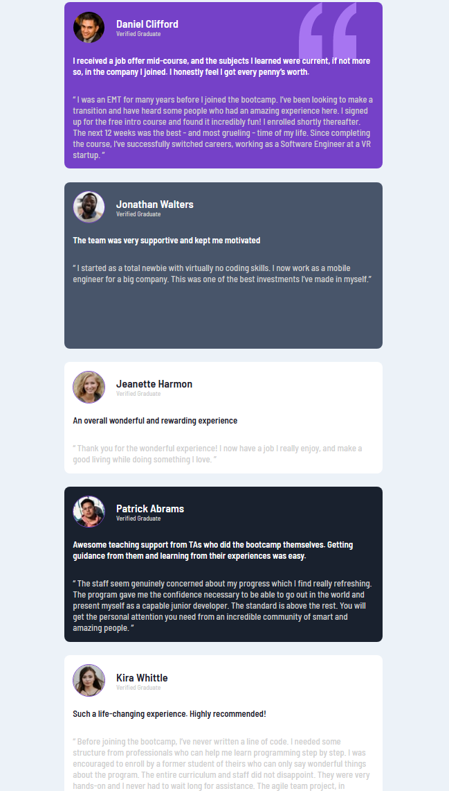
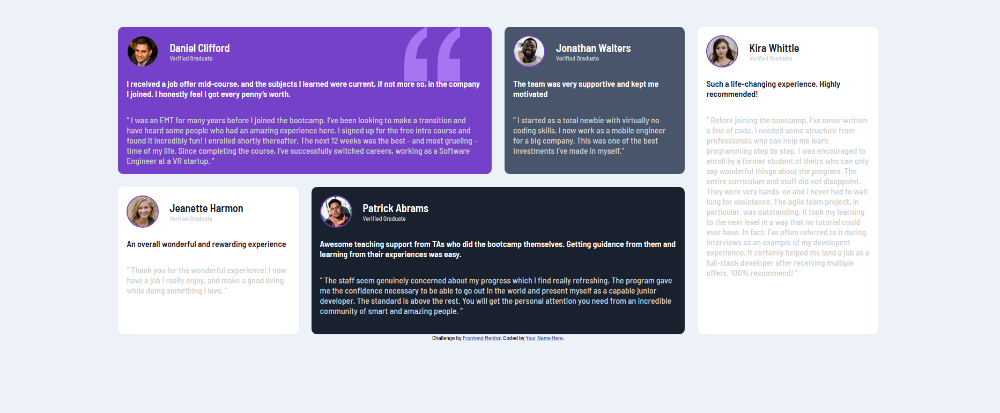

# Frontend Mentor - Testimonials grid section solution

This is a solution to the [Testimonials grid section challenge on Frontend Mentor](https://www.frontendmentor.io/challenges/testimonials-grid-section-Nnw6J7Un7). Frontend Mentor challenges help you improve your coding skills by building realistic projects.

## Table of contents

- [Frontend Mentor - Testimonials grid section solution](#frontend-mentor---testimonials-grid-section-solution)
  - [Table of contents](#table-of-contents)
  - [Overview](#overview)
    - [The challenge](#the-challenge)
    - [Screenshot](#screenshot)
    - [Links](#links)
  - [My process](#my-process)
    - [Built with](#built-with)
    - [What I learned](#what-i-learned)
    - [Continued development](#continued-development)
  - [Author](#author)
  - [Acknowledgments](#acknowledgments)

## Overview

### The challenge

Users should be able to:

- View the optimal layout for the site depending on their device's screen size

### Screenshot

Screenshot for mobile view 
Screenshot for desktop view 

### Links

- Solution URL: [Solution](https://github.com/AkshayV30/testimonials-grid-section-main)
- Live Site URL: [Live site](https://akshayv30.github.io/testimonials-grid-section-main/)

## My process

### Built with

- Semantic HTML5 markup
- CSS custom properties
- CSS Grid
- Desktop-first workflow
-

### What I learned

I learned about css Grid property following are few commands that i have worked on particularly for this webapage

```
display:grid;

grid-column: 1 / 3;
grid-row: 1 / 2;

grid-template-columns: repeat(4, 1fr);
grid-template-rows: repeat(2, 1fr);
gap: 1.5rem;
```

### Continued development

## Author

- Website - [Akshay V30](https://github.com/AkshayV30)
- Frontend Mentor - [@AkshayV30](https://www.frontendmentor.io/profile/AkshayV30)

## Acknowledgments

I would like to give thanks kevin-powell
